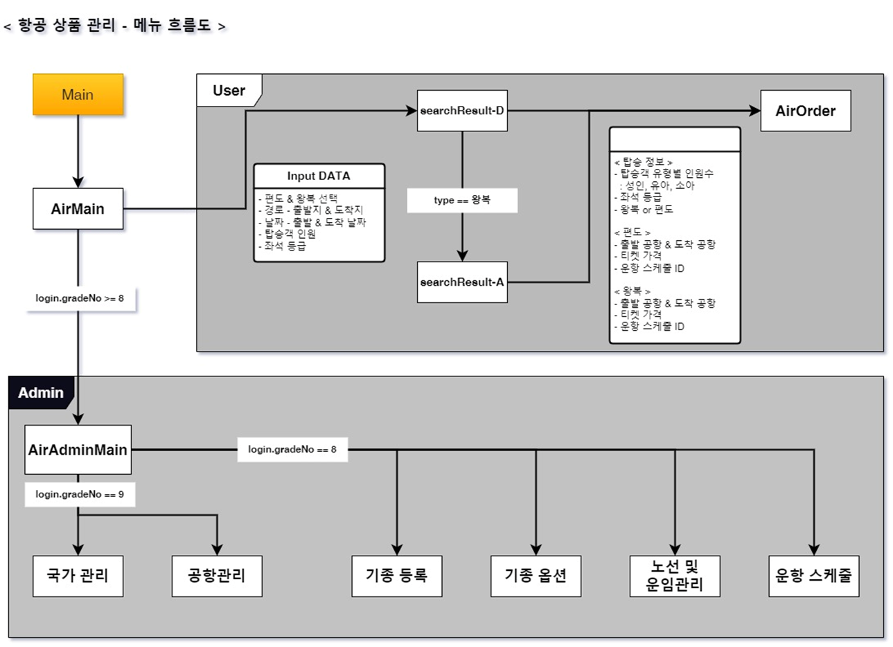

# Team Project - Bangkok
Spring Legacy Project

## 발표 자료
- 자세한 내용은 레파지토리에 `[Project]Spring_1team_Bangkok_ppt_240927_1.pdf` 파일 참고

## 프로젝트 개요
* **이름** : 방방곡곡슝슝 (Bangkok)
* **기간** : 2024.09.11 ~ 2024.09.27
* **주제** : 여행 포털 사이트
* **설명** : 여행을 준비하기 위한 여행 정보, 여행 플랜 짜기, 항공권 예약, 호텔 예약 서비스
* **목적**
    - 여행의 관련된 모든 준비를 할 수 있는 종합 서비스 플랫폼 구축
    - 사용자 친화적인 간편한 시스템 개발
    - 여행과 관련된 상품 판매의 확장성

* **프로젝트 기능 및 담당 역할 (총 7명)**

|**순서**|**이름**|**역할**|**담당 기능**|**비고**|
|---|---|---|---|---|
|1|박지현|팀장|호텔 검색, 호텔 등록 시스템|-|
|2|원필재|PM|항공 검색,항공 노선관리 시스템|-|
|3|나태준|부PM|호텔 예약, 고객센터, 호텔 후기 시스템|-|
|4|윤해연|PL|항공 예약 시스템|-|
|5|함수진|부PL|메인, 회원 관리|-|
|6|지유빈|DBA|여행플랜 짜기 시스템|-|
|7|고민희|서기|여행 정보 게시판|-|

## 요구사항 정의
- 자세한 내용은 레파지토리에 `BANGKOK_requiredSpecity.pdf` 파일 참고

## 각 모듈 개발 범위

## 소요 자원

|자원 분류|자원 이름|비고|
|---|---|---|
|**OS**|Window 10, 11|-|
|**DB 설계**|SQL Developer|-|
|**IDE**|Spring Tool Suite 3|-|
|**DBMS**|Oracle 11g XE|-|
|**WAS**|Apache Tomcat 9|-|
|**개발 프레임 워크**|JDK 11, Spring Framework|-|
|**DB 모델링**|ER-Win7|-|
|**Team Work**|Visual SVN|-|
|**Library**|jQuery, Bootstrap4, cos, JSTL, SiteMesh, Mybatis, Lombok|-|

## 메뉴 흐름도
### 회원 관리 - 부PL 함수진

### 이벤트 - 부PM 나태준

### 항공권 관리 - PM 원필재

### 항공권 예약 - PL 윤해연

### 호텔 관리 - 팀장 박지현

### 호텔 예약 - 부PM 나태준

### 호텔 후기 - 부PM 나태준

### 여행 정보 게시판 - 서기 고민희

### 게시판 댓글 기능 - DBA 지유빈

### 여행 계획 짜기 게시판 - DBA 지유빈

## 테이블 정의서
- 자세한 내용은 레파지토리에 `BANGKOK_DBTable.pdf` 파일 참고